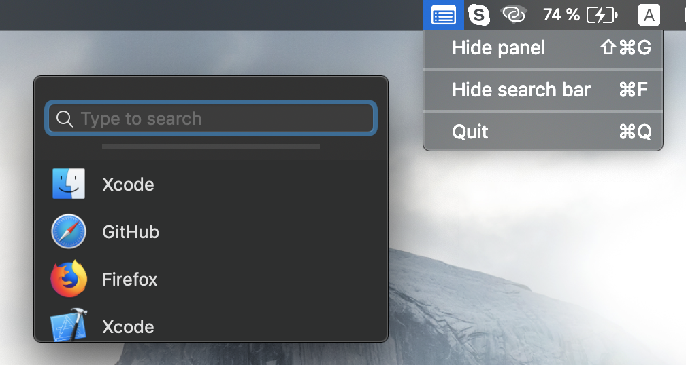
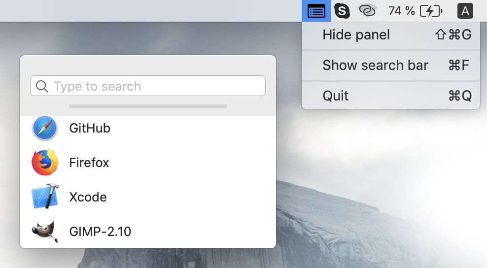

  

This application allows you to save and quickly open any URL.

# Usage

Use drag'n'drop to insert, reorder or remove URL's. To open items list use ⌥ + ⇧ + G hotkey. 
You also can enable search bar by using ⌘ + F combination.
This app support macOS Mojave light and dark themes "out of box".

# Installation

Feel free to download source code and build it using Xcode (or just download image [here](.github/GoTo.dmg)).

# Screenshots

Dark             |  Light
:-------------------------:|:-------------------------:
  |  
